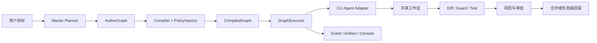

# Agent Hub

[](https://github.com/xuanc1120-prog/agent-hub-graph/actions/workflows/ci.yml)

Agent Hub 是一个面向 Coding Agent 的本地可视化编排平台。它把任务拆解、Agent 分配、节点依赖、权限注入、执行审计和人工审批组织成一张可编辑、可追踪的工作流图。

项目目标可以概括为 **“面向 Coding Agent 的 ComfyUI”**：用户不再需要分别操作 Claude Code、Codex、OpenCode 等工具，而是由 Master 根据目标生成任务图，再由确定性执行器按经过安全编译的节点图调度各个 Agent。

> 当前项目仍处于 Demo 开发阶段，尚未完成真实 Agent 执行闭环，不应直接用于生产仓库或不受信任的代码。

## 核心设计

- **可视化工作流是核心产品能力**：React Flow 将承担节点创建、依赖连线、Agent 拖拽分配、执行状态和审批结果展示，而不是只做只读监控页面。
- **Master 具备规划能力**：Planner 负责拆分任务、生成节点、提出 Agent 推荐和记录假设；GraphExecutor 不依赖模型临场决定下一步。
- **作者图与执行图分离**：用户编辑 `AuthorGraph`，后端经过 Compiler、PolicyInjector 和 Validator 生成不可直接篡改的 `CompiledGraph`。
- **智能规划与确定性执行分离**：模型可以提出方案，但权限、依赖、状态转换、重试和审批由代码控制。
- **统一 CLI Agent 接入层**：第一版真实 Agent 目标为 OpenCode，Codex、Claude Code 和 Aider 先提供禁用状态与能力探测骨架。
- **本地优先并完整审计**：SQLite 保存状态和索引，大型 console、diff、patch 与报告保存为 Artifact，关键动作写入事件流。
- **Demo 共享写入区受控**：执行写任务时使用单写租约，记录 dirty diff 归属；失败时只反向应用当前任务 patch，禁止粗暴执行全局 `git reset`。

## 目标执行链



安全边界遵循以下原则：

1. Planner 只能生成结构化草案，不能直接执行命令或修改仓库。
2. Agent 的 prompt 不是安全边界，最终权限来自 CompiledGraph 和运行时策略。
3. 路径、命令、diff、敏感文件和风险等级分别经过 Guard 校验。
4. L4 操作直接拒绝，不能通过审批绕过。
5. Agent 子进程不能获得 Agent Hub API Token，也不能自行批准任务。

详细设计见 [开发方案](agent-hub-development-plan.md)。

## 当前进度

截至 2026-07-16，阶段 0 已完成，阶段 1 完成 2/4：

| 任务 | 状态 | 内容 |
|---|---|---|
| `HUB-000` | 已完成 | Git、Python、Vite、测试和数据目录基线 |
| `HUB-010` | 已完成 | v1 核心协议冻结，标签为 `contracts-frozen-v1` |
| `HUB-020` | 已完成 | CI、锁文件、依赖审计、Vitest 与 Playwright 基线 |
| `HUB-030` | 已完成 | OpenCode 1.2.27 capability manifest 与兼容性报告 |
| `HUB-100` | 已完成 | SQLite、Repository、CAS、幂等与 fencing lease |
| `HUB-120` | 已完成 | RuleBasedPlanner、AgentRouter、fallback 与 lineage |
| `HUB-130` | 下一项 | ContextPack、ArtifactStore 与 EventRegistry |
| `HUB-110` | 待执行 | Compiler、Executor 与 MockAgent 纵向闭环 |

当前仓库已经具备协议、存储、规划、路由和工程验证基础，但以下部分尚未完成：

- Compiler、PolicyInjector、DurableScheduler 和 GraphExecutor；
- Context/Artifact/Event 完整基础设施；
- 共享工作区 Guard、审批和恢复链；
- OpenCode 真实执行 Adapter；
- FastAPI 业务 API 与完整 React Flow GUI。

任务状态和 Owner 以 [开发任务看板](agent-hub-task-allocation.md) 为准。

## 技术栈

| 层级 | 技术 |
|---|---|
| 后端 | Python 3.11+、FastAPI、Typer、Pydantic、SQLite、aiosqlite |
| 前端 | React 19、TypeScript、Vite、React Flow、Dagre、Lucide |
| 测试 | pytest、Vitest、Testing Library、Playwright |
| 质量与安全 | Ruff、pip-audit、Oxlint、npm audit、GitHub Actions |

## 仓库结构

```text
app/                 CLI、配置与 FastAPI 入口
master/              Planner、Router 与协调逻辑
protocol/            冻结的 v1 数据契约
workflow/            工作流模型及后续执行组件
storage/             SQLite、Repository、幂等与租约
adapters/            CLI Agent 能力探测与后续 Adapter
context/             Planner/Task 上下文组件
security/            Guard 与安全策略组件
console/             Console、审批与流式输出组件
migrations/          SQLite schema
web/frontend/        React Flow 前端
tests/               后端、前端和集成测试
docs/                ADR、契约与兼容性报告
development-tasks/   可交付任务简报
```

## 本地运行

### 前置环境

- Python 3.11 或更高版本
- Node.js 20 或更高版本
- Git
- 推荐安装 `uv`

### 初始化后端

```powershell
uv venv .venv --python python3.11
uv pip sync requirements.lock --python .venv\Scripts\python.exe
uv pip install -e . --no-deps --python .venv\Scripts\python.exe

.venv\Scripts\agent-hub.exe init-data
.venv\Scripts\agent-hub.exe init-db
.venv\Scripts\agent-hub.exe doctor
.venv\Scripts\agent-hub.exe serve
```

API 默认监听 `http://127.0.0.1:8765`。运行数据默认保存在源码树之外：

- Windows：`%LOCALAPPDATA%\AgentHub`
- Linux/macOS：`~/.local/share/agent-hub`

可通过 `AGENT_HUB_DATA_DIR` 覆盖数据目录。

### 启动前端

```powershell
cd web\frontend
npm ci
npm run dev
```

当前前端仍是契约与图 fixture 基线，完整工作流编辑体验将在后续阶段实现。

## 验证

Windows PowerShell 下运行完整本地 CI：

```powershell
scripts\ci.ps1
```

WSL、Linux 或 macOS：

```bash
bash scripts/ci.sh
```

完整验证包含：

- Python 3.11/3.12/3.13 测试矩阵；
- Ruff check 与 format check；
- pytest；
- `pip-audit --strict`；
- 前端 lint、Vitest 和生产构建；
- `npm audit`；
- Playwright Chromium smoke test。

## 贡献与协作记录

仓库所有者和最终集成负责人为 [Inlysanko（@xuanc1120-prog）](https://github.com/xuanc1120-prog)。Git 提交使用该 GitHub 账号的 noreply 邮箱，以保证公开仓库中的作者归属正确。

本项目采用多 Agent 协作开发。以下记录表示实际任务分工，不代表这些工具拥有独立 GitHub 账号：

| 协作方 | 已承担工作 |
|---|---|
| Codex | 项目初始化、方案审查、SQLite/租约基础、跨分支集成、安全审查与发布 |
| Claude Code | `HUB-010` 核心协议、`HUB-120` Planner/Router 与交叉架构审查 |
| Hermes | `HUB-020` CI、依赖审计、Playwright 基线与 QA 支持 |
| OpenCode | `HUB-030` CLI capability spike、兼容性 manifest 与进程能力验证 |

GitHub 的 Contributors 页面只统计能够关联到 GitHub 账号的提交邮箱，不能完整表达 AI Agent 的协作分工，因此以本节和任务看板作为项目贡献记录。

## 许可证

当前项目在 `pyproject.toml` 中标记为 `Proprietary`，尚未附带开放源代码许可证。仓库公开可见不等于授予复制、分发或商用许可。
